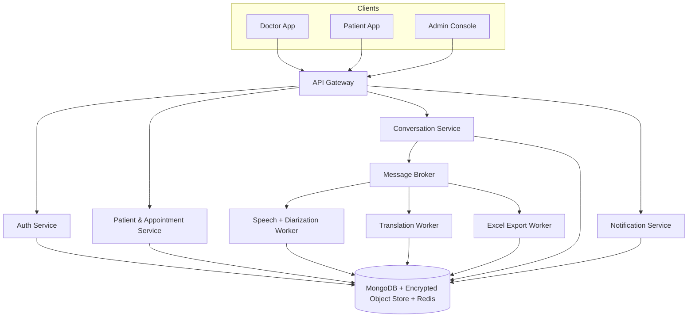

# CarePulse — Conversation Recording, Diarization & Translation

Design doc for three additions to CarePulse: doctor/patient auth, a doctor↔patient
conversation recorder with speaker diarization + Excel export, and live two-way
translation. Written for a **$0 budget** — every recommendation below is free/open
source or a perpetual free tier that never asks for a card.

## Free tech stack

| Need | Free choice | Notes |
|---|---|---|
| Speech-to-text | [faster-whisper](https://github.com/SYSTRAN/faster-whisper) (Whisper, self-hosted) | Runs on your own CPU/laptop, no per-minute cost. `small`/`base` model is fast enough for near-real-time on CPU. |
| Speaker diarization | [pyannote.audio](https://github.com/pyannote/pyannote-audio) 3.1 | Free, open weights (accept terms once on Hugging Face, no payment). Distinguishes Doctor/Patient/Attendant as Speaker 1/2/3. |
| Translation | [NLLB-200](https://huggingface.co/facebook/nllb-200-distilled-600M) distilled 600M (self-hosted via a local Flask server) | Free, open-weight, ungated. Covers English/Hindi/Kannada. Switched from LibreTranslate, whose Argos catalog lacks Kannada. |
| Excel export | `exceljs` (npm) | Free library, already MIT licensed. |
| Object storage | Local encrypted disk now → [MinIO](https://min.io/) (self-hosted, Docker) later | Free forever since you run it yourself; no AWS S3 bill. |
| Message broker (Phase 4) | RabbitMQ (Docker, free) | Only stood up when you actually split services out. |
| Database | MongoDB Atlas free tier (M0, 512MB, no card) | Already what CarePulse uses. |
| Hosting (when you want a live demo link) | Render/Railway free web service + Vercel/Netlify for the frontend | Free tiers sleep when idle — fine for a portfolio demo, not for 24/7 uptime. |
| Secrets | `.env` + GitHub Actions secrets | A real Vault/KMS is overkill at this scale and isn't free to run managed. |

Everything above is swappable later behind small provider interfaces if you ever do want
to pay for higher-accuracy cloud APIs (Azure/AWS/Google) — the app code won't need to change.

## Target architecture

This is the **end state**, not day one. See roadmap below for why we build it as a
modular monolith first and extract services only once the AI workers are actually a
bottleneck — standing up Kafka/K8s before you have a working feature just adds
maintenance for no benefit, especially solo.

## Data model additions

- `Doctor { name, email, passwordHash, specialization }` — done in Phase 0.
- `ConversationSession { doctorId, patientId, startedAt, endedAt, consent{ givenBy, timestamp }, languagePair, status, audioObjectKey }`
- `TranscriptSegment { sessionId, speakerLabel, role, text, translatedText, timestampMs }`

## Security checklist (PHI-grade, still free)

- [ ] TLS in transit (free via Let's Encrypt when hosted)
- [x] AES-256 at rest for audio files (Node `crypto`, key from env var — free). Transcript
      text is not yet field-level encrypted, only the audio blob (Day 8 scope was audio).
- [x] RBAC: doctor sees only their own sessions, patient sees only their own
- [x] Explicit recording consent captured with timestamp before recording can start
- [x] Append-only audit log collection (who viewed/downloaded what, when)
- [ ] Short-lived signed download links instead of public static paths (not needed — every
      download route is already behind JWT auth + ownership check, no public static path exists)
- [ ] Defined retention window + delete-on-request

## Roadmap — small, daily-commit-sized tasks

Each checkbox below is scoped to be one sitting's worth of work, so a real day of
progress maps to a real commit. **Don't backdate or fabricate commit history** — a
GitHub graph with gaps but real commits is worth more to anyone reviewing it than a
fake unbroken streak, and it's easy to tell the difference (message timestamps, PR
history, code quality). Skipping a day and committing twice the next is completely fine.

### Phase 0 — Auth foundation (done ✅ this session)
- [x] Doctor model + password hashing
- [x] `requireAuth(...roles)` middleware, generalized from `requireAdmin`
- [x] Doctor register/login endpoints
- [x] Doctor login/register pages + protected `/doctor/dashboard` route

### Phase 1–3, broken into a 10-day sprint

Tooling note: STT originally targeted `nodejs-whisper`, but that compiles whisper.cpp
from source and this dev machine has no C/C++ toolchain. Switched to **prebuilt**
whisper.cpp + ffmpeg Windows binaries (downloaded once via `npm run setup:speech` in
`backend/`, see `backend/scripts/setupSpeechTools.js`) — still free, no compiler
needed. Node shells out to them via `child_process`.

Diarization originally targeted pyannote.audio, but its accurate pipeline is gated on
Hugging Face (needs an account + accepted terms + access token — a manual step, skipped
to keep today's sprint moving). Also, Resemblyzer (the obvious open alternative) pulls
in `webrtcvad`, which has no prebuilt Windows wheel and needs a compiler we don't have
either. Landed on classic MFCC-feature clustering (`librosa` + `scikit-learn`, no neural
model, no login, no compiler) — a real accuracy tradeoff vs. pyannote, but $0 and
zero-friction. Runs as a one-shot Python script (`backend/pyservices/diarize.py`) via a
local venv (`npm run setup:diarize`), not a persistent microservice — simpler to manage
and matches the whisper.cpp integration pattern.

- [x] **Day 1** — `ConversationSession` model, `POST /api/conversations` (start) /
      `PUT .../:id/stop` (stop), doctor-auth-gated. Conversation page shell: search/pick
      an existing patient, Start/Stop button wired to these endpoints (no audio yet).
      See [devlog/2026-07-08.md](devlog/2026-07-08.md).
- [x] **Day 2** — Browser `MediaRecorder` captures mic audio; on Stop, upload the blob
      (extend the existing Multer `upload.js` `fileFilter` to accept audio mimetypes);
      store the file path on the session; add playback of the recorded clip.
      See [devlog/2026-07-08.md](devlog/2026-07-08.md).
- [x] **Day 3** — Wire prebuilt whisper.cpp + ffmpeg: transcribe the uploaded file to
      plain text (batch, no diarization yet), display it under the session.
      See [devlog/2026-07-08.md](devlog/2026-07-08.md).
- [x] **Day 4** — Diarize each Whisper segment (MFCC clustering, see tooling note above)
      and merge speaker labels into the transcript.
      See [devlog/2026-07-08.md](devlog/2026-07-08.md).
- [x] **Day 5** — Map generic `Speaker 1/2` labels to Doctor/Patient/Patient Party roles;
      doctor can relabel a misidentified speaker inline; render as `Doctor: ...` /
      `Patient: ...` / `Patient Party: ...`.
      See [devlog/2026-07-08.md](devlog/2026-07-08.md).
- [x] **Day 6** — `exceljs` generates the .xlsx (time/speaker/statement); download
      endpoint checks the requesting doctor owns the session. Generated on-demand at
      download time rather than eagerly on Stop, so it always reflects the latest
      Day 5 speaker-role relabeling instead of baking in stale labels.
      See [devlog/2026-07-08.md](devlog/2026-07-08.md).
- [x] **Day 7** — Consent capture (checkbox/toggle, timestamped) gating the Start button;
      minimal append-only `AuditLog` collection recording start/stop/download events.
      See [devlog/2026-07-08.md](devlog/2026-07-08.md).
- [x] **Day 8** — Security pass: AES-256-GCM-encrypt the audio file at rest (Node
      `crypto`, memoryStorage upload so plaintext never touches disk); ownership checks
      already existed on every session/transcript/Excel/audio/audit route. Also found
      and fixed a live credential leak (real Mongo/JWT/passkey secrets committed in
      `.env.example` on a public repo since the first commit) — rotated with the user.
      See [devlog/2026-07-08.md](devlog/2026-07-08.md).
- [x] **Day 9** — Doctor dashboard: replace the Phase 0 placeholder with a real list of
      past sessions (date, patient, status), click through to view transcript + re-download.
      Extracted the transcript/playback/relabel/Excel UI into a shared `SessionTranscript`
      component used by both the Conversation page's inline list and the new detail view.
      See [devlog/2026-07-08.md](devlog/2026-07-08.md).
- [x] **Day 10** — Local translation server + language-pair picker + Translate action per
      session; translations persist on each segment (and flow into the Excel export),
      reusing the same session (this is the seed of Phase 3, not the full real-time
      version). Originally built on LibreTranslate (Docker), then **switched to NLLB-200**
      (local Flask server, `npm run setup:translate`) because LibreTranslate's Argos
      catalog has no Kannada, which the user needs — NLLB covers en/hi/kn.
      See [devlog/2026-07-08.md](devlog/2026-07-08.md).

Each day's box maps to roughly one commit. If a day runs long or short, that's normal —
push what's real for that day rather than padding it out.

### Phase 4 — Harden security
- [ ] Field-level encryption for transcript text
- [ ] Audit log collection + a simple admin view of it
- [ ] Signed short-lived download URLs for audio/Excel
- [ ] Retention policy + delete endpoint

### Phase 5 — Extract services (only once Phase 1-4 work and feel slow)
- [x] **Day 20** — Speech worker extracted from the API: the heavy pipeline
      (decrypt → whisper → diarize → save) now runs in a dedicated process
      (`backend/worker.js`, `npm run worker`) consuming jobs from **RabbitMQ**.
      The API publishes a job on Stop and stays responsive; `prefetch(1)` lets
      multiple workers load-balance. If the broker is unreachable, the API
      falls back to in-process processing — a broker outage degrades
      performance, never drops transcripts.
- [x] **Day 20** — `docker-compose.yml`: RabbitMQ (with healthcheck +
      management UI on :15672) and the gateway. Node services + worker run on
      the host during dev because they shell out to Windows-native
      whisper/ffmpeg binaries and local Python venvs — containerizing them
      means Linux builds of that tooling (a documented later step, not done).
- [x] **Day 20** — API Gateway (Nginx in Docker, :8080): single entry point
      routing `/api/*` → API service and `/` → frontend (with websocket-aware
      proxying for Vite HMR).
- [ ] Split auth/patients/appointments into separate services with per-service
      databases (the full diagram) — not done; the API service is still one
      Express app and all services share one MongoDB.
- [ ] Containerize the Node services + speech worker (needs Linux
      whisper/ffmpeg + Python-in-image for diarization/translation).

### Phase 6 — Extras
- [x] Medication/symptom keyword highlighting — **Day 11**: keyword/pattern extraction of
      medications, dosage/timing, and symptoms into a "Key items" summary (UI chips + Excel
      block). First pass is deterministic keyword/regex (doctor confirms, never auto-decides);
      could later add inline highlighting or an NLP model. See [devlog/2026-07-08.md](devlog/2026-07-08.md).
- [ ] Patient portal: view own conversation history
- [ ] Medication-reminder notifications derived from the transcript
- [x] Multi-speaker sessions — **Day 15**: 2-4 people in the room, "patient party"
      separated into its own speaker cluster.
