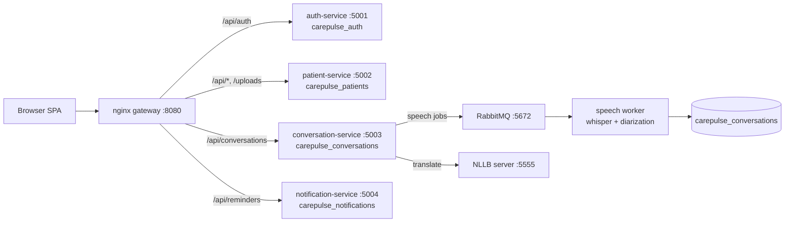

# CarePulse

> ### 🔗 Live demo — **[carepulse-mern.vercel.app](https://carepulse-mern.vercel.app)**
> Running free: frontend on Vercel, API on Render, database on MongoDB Atlas.
> **First load can take ~30–60s** while the free backend wakes from sleep — click and wait once.
> The on-device AI (recording → live transcript → diarization → translation) runs in the local
> Docker stack, not the free demo; see **[DEPLOY.md](DEPLOY.md)** for how it's deployed.

CarePulse is a **doctor↔patient consultation recorder** for a healthcare app. A doctor
records a consented conversation; CarePulse transcribes it, separates who said what,
labels roles, pulls out medications/timing/symptoms, exports an Excel summary, and can
translate the transcript (text, spoken, and live) across **18 languages, any→any**, with the spoken language auto-detected (English, Hindi, Kannada, Tamil, Telugu, Malayalam, and more).
Audio and transcript text are encrypted at rest, every access is audited, and patients
get a read-only portal to their own transcripts.

It started as a single MERN appointment app and grew, in small daily commits, into a
set of **per-domain microservices** behind an API gateway, with the heavy speech work
offloaded to a queue-driven worker — all on a strict **$0, self-hosted, open-source**
budget (no paid AI APIs).

---

## Features

**Consultation recording & transcription**
- Consent-gated audio capture in the browser (`MediaRecorder`), stored **AES-256-GCM
  encrypted** on disk.
- Speech-to-text via self-hosted **whisper.cpp** (no per-minute API cost).
- **Speaker diarization** (2–4 speakers, incl. a "patient party" for family in the room)
  via neural **pyannote.audio**, with MFCC clustering (`librosa` + `scikit-learn`) as a
  zero-setup fallback.
- Doctor relabels generic `Speaker 1/2` → **Doctor / Patient / Patient Party** inline.
- **Live transcript while recording** — primary transport is a **WebSocket**, with a 5s
  HTTP-poll fallback; the server transcribes incrementally (only new audio past a
  committed offset).

**Clinical assist & export**
- Deterministic **key-item extraction** — medications, dosage/timing, symptoms — shown as
  chips and highlighted inline (doctor confirms; never auto-decides).
- **Excel export** (`exceljs`) of the timestamped, role-labelled transcript.
- **Translation** (text + spoken via Web Speech, + live) using self-hosted **NLLB-200**
  (18 languages any→any, source auto-detected); the UI hides itself gracefully when the translate server
  is down.

**Patient portal**
- Doctor issues a signed **invite link**; patient activates a password and logs in.
- Patients get **read-only** access to their own sessions, transcripts, key items, and
  Excel download — nothing else.

**Reminders**
- Medication reminders **suggested** from a session's key items (frequency → dose times,
  "for N days" → end date); doctor edits and confirms. Patients see them on their
  dashboard with a "due today" badge (in-app delivery).

**Health Records module** (Day 34 — "Health records" from the doctor dashboard)
- **Doctor directory** — personal add/edit/delete list of doctors with specialization,
  contact and hospital details; search + specialization filter.
- **Medical documents** — upload lab reports / prescriptions / bills / insurance,
  stored on **Cloudinary** (free tier) with a local-disk fallback when unconfigured;
  preview, download, delete (delete also purges the CDN cache).
- **Visit history** — record visits (date, reason, diagnosis, treatment notes) linked
  to a directory doctor, with documents attached.
- **Appointment scheduling** — book with a directory doctor, mark completed, and get
  **email reminders**: an automated daily **9 AM** sweep (Gmail SMTP app password,
  free) plus a manual "send now" trigger; each appointment is reminded exactly once.
- **AI pharmacy assistant** — upload a prescription image and extract medication
  names via the **Gemini API free tier** (suggestions the user confirms); search
  drug details (purpose, dosage, warnings, side effects) and find **generic
  alternatives** from the public **openFDA** database (no key required).
- **Overview dashboard** — counts, upcoming appointments, recent visits; plus
  profile management (name, specialization, password change).

**Security / PHI-grade (still free)**
- **RBAC** across three roles (`admin` / `doctor` / `patient`) via JWT; a doctor sees only
  their own sessions, a patient only their own.
- **AES-256-GCM at rest** for both audio blobs and transcript text (field-level).
- **Append-only audit log** (start/stop/download, with patient-vs-doctor attribution) +
  an **admin audit view** across all doctors.
- **Short-lived signed download URLs** (5-min, session+kind-scoped) for audio/Excel.
- Explicit timestamped **consent** before recording; **right-to-delete**; opt-in
  **retention windows**.

---

## Architecture

Locally / in Docker, CarePulse runs as four independent services, each owning its own
database, behind an nginx gateway, with speech work handed to a RabbitMQ-driven worker:



- **Cross-service boundary is the JWT only** (shared secret) — services never query each
  other's databases. A doctor-issued, signed invite is how the patient service vouches
  for a user to the auth service without a lookup.
- **Broker-down fallback:** if RabbitMQ is unreachable, the conversation service runs the
  speech pipeline in-process — a broker outage degrades performance, never drops
  transcripts.
- **Hosted (free) mode** collapses the four services into one process against one database
  (`backend/combined-server.js`) so it fits a single free instance — same route code,
  same models, different composition. See [DEPLOY.md](DEPLOY.md).

Full design notes, the free-stack table, and the day-by-day build log:
[ARCHITECTURE.md](ARCHITECTURE.md) · [devlog/2026-07-08.md](devlog/2026-07-08.md).

---

## Tech stack

| Layer | Choice |
|---|---|
| Frontend | React 18, Vite, React Router, React Hook Form + Zod, Tailwind CSS, Axios |
| Backend | Node.js, Express, Mongoose (MongoDB Atlas), `ws` (WebSocket), Multer |
| Auth | JWT (admin / doctor / patient roles), bcrypt |
| Speech-to-text | self-hosted **whisper.cpp** (prebuilt binaries, no compiler needed) |
| Diarization | **pyannote.audio** (neural), MFCC clustering fallback (`librosa` + `scikit-learn`) |
| Translation | self-hosted **NLLB-200** distilled 600M (Flask server) |
| Async / infra | RabbitMQ (worker queue), nginx (API gateway), Docker Compose |
| Crypto | AES-256-GCM (Node `crypto`) for audio + transcript text at rest |
| Export | `exceljs` |
| Hosting (demo) | Vercel (frontend) + Render (backend) + MongoDB Atlas — all free tiers |

Every AI component is free and self-hosted; nothing calls a paid API.

---

## Project structure

```
mern/
  backend/
    *-server.js            per-domain service entrypoints (auth/patient/conversation/notification)
    combined-server.js     single-process entrypoint for free hosting
    worker.js              RabbitMQ speech worker
    controllers/ routes/ models/ services/   Express + Mongoose + pipeline code
    pyservices/            diarize.py, translate_server.py (NLLB)
    Dockerfile.api  Dockerfile.worker
  frontend/                React (Vite) SPA
  gateway/nginx.conf       API gateway routing
  docker-compose.yml       rabbitmq + gateway + (profile) services & worker
  ARCHITECTURE.md  DEPLOY.md  devlog/
```

---

## Running it locally

**Prerequisites:** Node.js 20+, Docker Desktop, a MongoDB connection string (free Atlas
M0 is fine), and Python 3 (for the diarization / translation servers).

1. **Backend env** — `cd backend && cp .env.example .env`, then set `MONGO_URI`,
   `JWT_SECRET`, `ADMIN_PASSKEY`, and `AUDIO_ENCRYPTION_KEY` (a 64-char hex — generate with
   `node -e "console.log(require('crypto').randomBytes(32).toString('hex'))"`).
2. **Infra + services** (gateway, broker, all four services, speech worker):
   ```bash
   docker compose --profile containers up -d
   ```
3. **Frontend:**
   ```bash
   cd frontend && cp .env.example .env   # VITE_API_URL defaults to the :8080 gateway
   npm install && npm run dev            # http://localhost:5173
   ```
4. **Translation (optional)** — start the NLLB server so the translate UI appears
   (`backend/pyservices/translate_server.py`, port 5555). See ARCHITECTURE.md for the
   one-time model/tooling setup.

The app is served through the gateway at **http://localhost:8080**. Without the AI
containers you still get the full app; recording/transcription just won't produce a
transcript.

---

## API reference

All non-public routes require a `Bearer <JWT>`; role in parentheses.

**Auth** — `/api/auth`
| Method | Path | Purpose |
|---|---|---|
| POST | `/admin-login` | passkey → admin JWT |
| POST | `/doctor/register` · `/doctor/login` | doctor account → JWT |
| POST | `/patient/activate` | redeem a portal invite, set password → patient JWT |
| POST | `/patient/login` | patient login |

**Patients & appointments** — `/api`
| Method | Path | Auth | Purpose |
|---|---|---|---|
| POST | `/users` | — | create/fetch patient identity |
| GET | `/users/lookup?email=` | doctor | find a patient |
| POST | `/users/:userId/portal-invite` | doctor | issue a signed portal invite |
| POST | `/patients` | — | full registration (multipart, ID upload) |
| GET/POST/PUT | `/appointments…` | mixed / admin | book, fetch, list, schedule/cancel |

**Conversations** — `/api/conversations`
| Method | Path | Auth | Purpose |
|---|---|---|---|
| GET · POST | `/` | doctor/patient · doctor | list own · start session |
| PUT | `/:id/stop` | doctor | stop + upload audio (queues transcription) |
| POST | `/:id/live` · WS `/live` | doctor | live transcript pass / stream |
| PUT | `/:id/speaker-roles` | doctor | relabel speakers |
| POST | `/:id/translate` | doctor | translate transcript |
| POST | `/:id/download-url` | doctor/patient | mint 5-min signed download link |
| GET | `/:id/excel` · `/:id/audio` | bearer **or** `?sig=` | export / decrypted audio |
| GET | `/:id/audit` · `/audit` | doctor · admin | session audit · all-doctor audit |
| GET · DELETE | `/:id` | doctor/patient · doctor | detail · right-to-delete |

**Reminders** — `/api/reminders`
| Method | Path | Auth | Purpose |
|---|---|---|---|
| POST | `/` | doctor | create (from key items) |
| GET | `/` | doctor/patient | list own |
| DELETE | `/:id` | doctor/patient | remove / dismiss |

---

## Deployment

A free, live deployment (Vercel + Render + Atlas) is documented step-by-step, including
the gotchas, in **[DEPLOY.md](DEPLOY.md)**.
